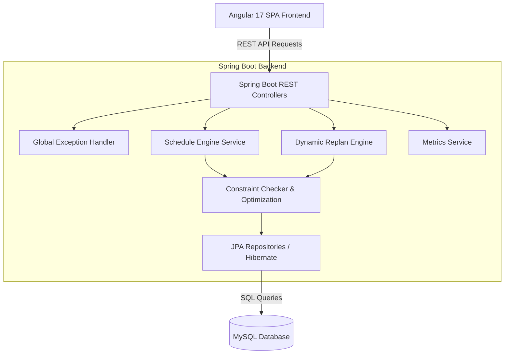

# 🎓 PlacementWeekScheduler

[](https://spring.io/projects/spring-boot)
[](https://angular.dev/)
[](https://www.mysql.com/)
[](https://www.oracle.com/java/)
[](#license)

An enterprise-grade, real-time automated **Campus Placement Week Scheduling & Dynamic Replanning System**. Designed to eliminate schedule overlaps, optimize room and panel resource utilization, handle unforeseen operational disruptions (room unavailabilities, interviewer dropouts, company schedule delays, student withdrawals), and maintain zero-conflict interview timetables for universities and placement cells.

---

## 🚀 Key Features

- **⚡ Automated Initial Schedule Generation**: Intelligent algorithm that schedules hundreds of candidates across tier-based companies, interview panels, and physical rooms while respecting slot constraints and time windows.
- **🔄 Dynamic Real-time Replanning Engine**:
  - **Room Availability Disruption**: Dynamically relocates affected interviews to vacant rooms without invalidating unaffected schedules.
  - **Panel Dropout Handling**: Reassigns pending candidate interviews to available qualified panel interviewers.
  - **Company Schedule Delays**: Cascades time offsets for delayed company arrival slots while re-checking room and panel availability.
  - **Student Withdrawals**: Safely cancels student interviews, freeing up slots for waiting candidates.
- **📊 Real-time Operations Dashboard**: Visual overview of placement metrics, interview coverage rate, room utilization, panel load, and disruption history.
- **🛡️ Bulletproof Global Exception Handling**:
  - Backend `@RestControllerAdvice` traps invalid inputs, missing resources, and unexpected runtime errors into clean, structured JSON API responses (`ErrorResponse`).
  - Frontend `HttpErrorInterceptor` traps network disconnections and API failures, displaying user-friendly toast alerts without breaking the user experience.
- **🔒 Credentials & Environment Security**: Environment variables via `.env` files protect sensitive database credentials from exposure on public repositories.

---

## 📐 System Architecture



---

## 🛠️ Technology Stack

| Layer | Technology |
| :--- | :--- |
| **Backend Framework** | Java 17+, Spring Boot 3.x, Spring Data JPA, Hibernate |
| **Frontend Framework** | Angular 17+ (Standalone Components, RxJS, Signals) |
| **Database** | MySQL 8.0+ |
| **Styling & UI** | Vanilla CSS3 Design System (Glassmorphic Badges, Responsive Layouts) |
| **Build & Package Tools** | Apache Maven (`mvnw`), Node.js (npm / Angular CLI) |
| **Error Handling** | `@RestControllerAdvice`, Angular `HttpErrorInterceptor`, Toast Notification System |

---

## 📁 Repository Structure

```
PlacementWeekScheduler/
├── placement-scheduler/              # Spring Boot Backend Project
│   ├── src/main/java/com/mirailabs/scheduler/
│   │   ├── config/                   # CORS & Application Runners
│   │   ├── controller/               # REST API Endpoints (Scheduling, Replan, Metrics)
│   │   ├── entity/                   # JPA Domain Entities (Company, Student, Room, Panel)
│   │   ├── exception/                # Global Exception Handling & Error DTOs
│   │   ├── metrics/                  # Analytics & System Summary Services
│   │   ├── replan/                   # Dynamic Replanning Engine & Disruption Handlers
│   │   ├── repository/               # Data Access Repositories
│   │   └── schedule/                 # Primary Scheduling & Constraint Checking Algorithms
│   └── src/main/resources/
│       └── application.properties    # Environment-backed configuration
├── placement-scheduler-ui/           # Angular 17 Frontend Project
│   ├── src/app/
│   │   ├── interceptors/             # Global HTTP Error Interceptor
│   │   ├── models/                   # TypeScript interfaces & DTOs
│   │   ├── pages/                    # Dashboard, Schedule, Conflicts, Replanning Views
│   │   └── services/                 # API Client Services & Toast Notifications
└── .gitignore                        # Global repository ignores (Protects credentials & builds)
```

---

## 🔧 Prerequisites

Before setting up the project, ensure you have the following installed on your machine:

- **Java Development Kit (JDK)**: Version 17 or higher
- **Node.js**: Version 18.x or higher
- **npm**: Version 9.x or higher
- **MySQL Server**: Version 8.0 or higher
- **Maven**: Version 3.8+ (or use the provided `./mvnw` wrapper)

---

## ⚙️ Environment & Credential Configuration

To keep credentials secure and prevent plain-text passwords from being exposed to GitHub:

1. **Copy the Environment Template**:
   ```bash
   cp .env.example .env
   ```

2. **Configure your Database Parameters in `.env`**:
   ```env
   SERVER_PORT=8080
   DB_URL=jdbc:mysql://localhost:3306/placement_scheduler?useSSL=false&allowPublicKeyRetrieval=true&serverTimezone=UTC
   DB_USERNAME=root
   DB_PASSWORD=your_actual_mysql_password
   DDL_AUTO=update
   CORS_ALLOWED_ORIGINS=http://localhost:4200
   ```

   > [!IMPORTANT]
   > The `.env` file is explicitly ignored in `.gitignore` to protect your credentials.

---

## 🐳 Docker Deployment (Recommended)

The easiest and fastest way to deploy the complete application stack (MySQL, Spring Boot Backend, and Angular Frontend) is using **Docker & Docker Compose**.

### Prerequisites
- [Docker Desktop](https://www.docker.com/products/docker-desktop/) (includes Docker Compose)

### 1-Command Startup
From the project root directory, run:

```bash
docker compose up -d --build
```

This single command will:
1. Spin up a **MySQL 8.0** database container with automatic health checking and volume persistence (`placement-scheduler-db`).
2. Build the **Spring Boot** backend container using multi-stage JDK 21 build (`placement-scheduler-backend`).
3. Build the **Angular** frontend container using multi-stage Node 20 build and serve it via **Nginx** (`placement-scheduler-frontend`).

### Accessing the Services
- **Angular Frontend**: `http://localhost` (or `http://localhost:4200`)
- **Backend REST API**: `http://localhost:8080/api`
- **MySQL Database**: `localhost:3306`

### Useful Docker Commands
```bash
# View running services and container status
docker compose ps

# View live application logs
docker compose logs -f

# Stop and remove containers
docker compose down

# Stop containers and remove database volume
docker compose down -v
```

---

## ☁️ Render Cloud Deployment Guide

Follow this sequence to deploy the application onto **Render.com**:

### 1. Hosted MySQL Database Setup
Provision a managed MySQL database instance (e.g. Aiven, PlanetScale, Railway, or AWS RDS) and obtain your connection parameters:
- `DB_URL`: `jdbc:mysql://<HOST>:<PORT>/<DATABASE_NAME>?useSSL=false`
- `DB_USERNAME`: Database user
- `DB_PASSWORD`: Database password

### 2. Backend Service Deployment (Render)
1. In Render Dashboard, click **New +** -> **Web Service**.
2. Connect your GitHub repository and set the **Root Directory** to `placement-scheduler`.
3. Choose **Docker** as the Runtime environment.
4. Add the following **Environment Variables**:
   - `DB_URL`: `jdbc:mysql://<HOST>:<PORT>/placement_scheduler?...`
   - `DB_USERNAME`: `<YOUR_DB_USER>`
   - `DB_PASSWORD`: `<YOUR_DB_PASSWORD>`
   - `DDL_AUTO`: `update`
   - `CORS_ALLOWED_ORIGINS`: `https://YOUR-FRONTEND-NAME.onrender.com`
5. Click **Create Web Service**. Once deployed, copy your backend URL (e.g. `https://placement-scheduler-backend.onrender.com`).

### 3. Update Angular Production Endpoint
In `placement-scheduler-ui/src/environments/environment.prod.ts`, set `apiUrl` to your deployed backend URL:
```typescript
export const environment = {
  production: true,
  apiUrl: 'https://placement-scheduler-backend.onrender.com/api'
};
```
Commit and push the change to GitHub:
```bash
git add placement-scheduler-ui/src/environments/environment.prod.ts
git commit -m "Configure production Render backend URL"
git push origin main
```

### 4. Frontend Service Deployment (Render)
1. In Render Dashboard, click **New +** -> **Web Service**.
2. Connect your GitHub repository and set the **Root Directory** to `placement-scheduler-ui`.
3. Choose **Docker** as the Runtime environment.
4. Render will automatically detect `EXPOSE 80` in the Dockerfile and launch Nginx.
5. Click **Create Web Service**.

---

## 🏁 Local Development Setup (Manual)

### 1. Database Setup

Create the MySQL database instance:
```sql
CREATE DATABASE placement_scheduler;
```

### 2. Backend Setup (Spring Boot)

Navigate to the `placement-scheduler` directory and launch the server:

```bash
cd placement-scheduler

# Build the application
./mvnw clean compile

# Run the application (Windows Command Prompt / PowerShell)
./mvnw spring-boot:run
```
The backend REST API server will start on `http://localhost:8080`.

### 3. Frontend Setup (Angular)

In a new terminal window, navigate to the `placement-scheduler-ui` directory:

```bash
cd placement-scheduler-ui

# Install dependencies
npm install

# Start the Angular development server
npm start
```
Open your browser and navigate to `http://localhost:4200` to access the Placement Operations Center.

---

## 📡 REST API Reference

### 📅 Scheduling Endpoints (`/api/scheduling`)
| Method | Endpoint | Description |
| :--- | :--- | :--- |
| `POST` | `/api/scheduling/generate` | Triggers automated schedule generation across all candidates |
| `GET` | `/api/scheduling/schedule` | Fetches filtered schedule (supports `date`, `companyId`, `roomId`, `panelId`, `studentId`) |
| `GET` | `/api/scheduling/schedule/summary` | Retrieves overall schedule summary metrics |

### 🔄 Replanning Endpoints (`/api/replan`)
| Method | Endpoint | Description |
| :--- | :--- | :--- |
| `POST` | `/api/replan/room-unavailable` | Handles room disruption & relocates affected interviews |
| `POST` | `/api/replan/panel-drop` | Handles interviewer panel dropouts & reassigns candidates |
| `POST` | `/api/replan/company-delay` | Handles company slot delays & updates timetable |
| `POST` | `/api/replan/student-withdraw` | Cancels student interviews upon withdrawal |
| `GET` | `/api/replan/history` | Fetches complete replanning audit history |

### 📊 Metrics Endpoints (`/api/metrics`)
| Method | Endpoint | Description |
| :--- | :--- | :--- |
| `GET` | `/api/metrics/summary` | Retrieves real-time placement statistics, room utilization, and panel workloads |

---

## 🛡️ Exception Handling Architecture

The application is engineered with crash-resilient exception handling across both tiers:

- **Backend Global Exception Handler (`@RestControllerAdvice`)**:
  - `ResourceNotFoundException` → Handled cleanly with `404 Not Found` JSON.
  - `SchedulingException` / `IllegalArgumentException` → Handled cleanly with `400 Bad Request` JSON.
  - `MethodArgumentNotValidException` → Returns field-level validation failure details.
  - Unexpected Server Exceptions → Caught by global fallback handler returning a structured `500 Internal Server Error` DTO while logging trace details without exposing raw stack traces.

- **Frontend Toast Notification & Interceptor**:
  - `HttpErrorInterceptor` intercepts API errors and network dropouts (`status 0`), raising real-time dismissible toast banners via `NotificationService` to maintain UI state integrity.

---

## 🤝 Contributing

Contributions are welcome! If you'd like to improve the scheduling algorithms, UI components, or test coverage:

1. Fork the repository
2. Create your feature branch (`git checkout -b feature/AmazingFeature`)
3. Commit your changes (`git commit -m 'Add some AmazingFeature'`)
4. Push to the branch (`git push origin feature/AmazingFeature`)
5. Open a Pull Request

---

## 📄 License

This project is licensed under the MIT License - see the LICENSE file for details.
